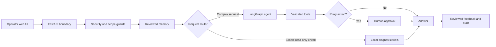

# OpsSentinel AI Incident Agent

A public reference implementation of a human-supervised DevOps agent. OpsSentinel AI
investigates incidents, uses local and model-driven tools, requests approval before
risky operations, and improves retrieval from reviewed outcomes.

## Live demo

- [Open OpsSentinel AI](https://opssentinel-ai.onrender.com/)
- [Health status](https://opssentinel-ai.onrender.com/health)
- [Developer API documentation](https://opssentinel-ai.onrender.com/developer/docs)

The hosted instance is for testing and demonstration. It runs with mock infrastructure
tools and may take a short time to wake after inactivity. Do not submit credentials,
customer data, proprietary logs, or other sensitive information.

> **Project status:** portfolio-quality reference application. The included
> infrastructure adapters are mocks; do not connect this repository directly to
> production systems.

## Safety model

- The agent answers only DevOps, CI/CD, deployment, cloud, SRE, monitoring, and
  production incident questions; unrelated requests are rejected before OpenAI is called.
- User input is limited to 2,000 characters, model context to the latest 6
  non-system messages, workflow execution to 4 agent steps, model output to 350
  tokens, and answers to approximately 180 words.
- A deterministic security guard blocks common prompt-injection, jailbreak, hidden
  prompt extraction, and instruction-echo attempts before the model is called.
- Model output and feedback are redacted for common API-key, token, password, and
  private-key patterns. Injection-like or secret-bearing content cannot enter cache.
- Tool service names use a strict DNS-style allowlist, preventing shell/path arguments.
- The local API rate-limits each client to 20 incident requests per minute.
- Unambiguous read-only health and log checks run through deterministic local tools
  without an LLM call; complex architecture and troubleshooting requests use the model.
- Service restarts always stop for explicit operator approval.
- The agent learns only from operator-approved feedback rated 4 or 5.
- Safe completed incidents are embedded into SQLite for semantic retrieval. Exact
  repeats return immediately; closely paraphrased requests can reuse a prior answer
  only above the configured similarity threshold.
- Learned lessons are context, not commands, and must be verified against current logs.
- Unit tests mock the language model and need neither Redis nor network access.

This is a production-hardened starter, not a complete production control plane. Replace
the mock tools with authenticated monitoring/orchestration adapters and add your
organization's authorization, audit retention, rate limits, and secrets manager
before connecting it to infrastructure.

Conversation turns, approval state, and rate-limit events are stored in the configured
database rather than process memory, so multiple workers on one shared filesystem remain
consistent. For multi-host replicas, point the persistence interface at a managed SQL
implementation. Add TLS at the ingress, immutable audit export, dependency/container
scanning, and per-environment service allowlists before a real production connection.

The application refuses to start with `APP_ENV=production` while `TOOL_MODE=mock`,
preventing demonstration tools from being mistaken for real infrastructure adapters.
Health probes are available at `/health` (liveness) and `/ready` (persistence readiness).
Security and approval events are written as redacted JSON Lines to `AUDIT_LOG_PATH`.

## Setup

```bash
python -m venv venv
source venv/bin/activate
pip install -r requirements.txt
cp .env.example .env
```

Set `OPENAI_API_KEY` in `.env`. The HTTP API uses in-memory graph checkpoints and
SQLite for reviewed lessons. A shared checkpoint/rate-limit service is only needed
when scaling beyond one process.

## Run

Local application:

```bash
./venv/bin/python main.py
```

API server:

```bash
./venv/bin/python -m uvicorn api:app --reload
```

Using `python -m uvicorn` is intentional: it guarantees Uvicorn and FastAPI are
loaded from this project's virtual environment instead of a globally installed
`uvicorn` command.

Open `http://127.0.0.1:8000` for the incident workspace. Developer-only API
documentation is available at `http://127.0.0.1:8000/developer/docs`.

Check **Create an AI architecture image** to receive the text response first and
then a GPT Image 2 diagram. The visual stage uses `POST /visuals`, is optional,
and refuses security-blocked or out-of-scope prompts. A prompt
that explicitly requests a diagram, image, visual, or flowchart also opts in.
Configure:

```env
IMAGE_GENERATION_ENABLED=true
IMAGE_MODEL=gpt-image-2
IMAGE_SIZE=1536x1024
IMAGE_QUALITY=medium
```

Production processes should omit `--reload`, bind behind a TLS-enabled reverse proxy,
and set `APP_ENV=production`. Startup will require a real tool adapter and API key.

### Vercel deployment

The Vercel FastAPI entrypoint is declared in `pyproject.toml` as `api:app`. Add
`OPENAI_API_KEY` and other secrets through the Vercel project settings, never to the
repository. For a public demonstration deployment, configure these writable paths:

```env
MEMORY_DB_PATH=/tmp/agent_memory.db
AUDIT_LOG_PATH=/tmp/audit.jsonl
GENERATED_IMAGE_DIR=/tmp/generated
```

Vercel functions have ephemeral local storage. SQLite memory, audit events, rate-limit
state, graph checkpoints, and generated files can disappear between invocations and
are not shared reliably across instances. Therefore Vercel is suitable only for the
demo UI/API. Before calling the deployment production-ready, replace those components
with managed persistent services and return generated images from object storage.

Usage history contains redacted prompts and is therefore admin-only. Configure a
random values for access and approval signing (approval signing requires at least 32 characters):

```env
USAGE_ADMIN_KEY=replace-with-a-long-random-value
OPERATOR_API_KEY=replace-with-a-different-long-random-value
AUTH_MODE=api_key
APPROVAL_SIGNING_SECRET=replace-with-at-least-32-random-characters
SESSION_RETENTION_DAYS=30
MONITORING_API_URL=https://monitoring.internal.example/v1/logs
ORCHESTRATION_API_URL=https://orchestrator.internal.example/v1/restarts
TOOL_API_TOKEN=replace-with-a-scoped-service-token
```

Then request history with `X-Admin-Key`:

```bash
curl -H "X-Admin-Key: $USAGE_ADMIN_KEY" \
  "http://127.0.0.1:8000/usage?limit=50"
```

`OPERATOR_API_KEY` authenticates production incident, session, and approval requests
through `X-Operator-Key`; the web UI keeps it in tab-scoped session storage. Approval
also requires a signed capability for the exact thread and action. Pending actions are
stored durably and claimed atomically, so retrying an approval cannot execute the same
action twice. Session summaries are redacted, owner-scoped, and retained according to
`SESSION_RETENTION_DAYS`. Never embed configured keys in client-side source code.

For enterprise identity, set `AUTH_MODE=oidc_proxy` and configure
`OIDC_PROXY_SECRET`. A trusted OIDC-aware ingress must validate issuer, audience,
signature, expiry, and MFA policy, then inject `X-Authenticated-User`,
`X-User-Roles`, and `X-OIDC-Proxy-Secret`. Supported roles are `investigator`,
`approver`, and `admin`; only approvers and administrators can execute actions.

Live tool mode uses authenticated JSON APIs. Log retrieval sends a GET request with
`service` and `window_minutes`; restarts send a POST body containing `service_name`
and `reason`, plus an `Idempotency-Key` header containing the durable action ID.

## Test

```bash
python -m unittest discover -v -p 'test*.py'
```

For copy-paste prompts covering diagnostics, architecture diagrams, learned memory,
changed intent, human approval, scope rejection, and injection protection, see
[Test prompts and expected results](docs/TEST_PROMPTS.md).

## DevOps datasets

The project includes Loghub HDFS, BGL, Apache, OpenSSH, Linux, and ZooKeeper 2K
samples with license/citation files, plus
20 original MIT-licensed diagnostic scenarios covering Kubernetes, CI/CD, Terraform,
containers, cloud, networking, observability, databases, caches, messaging, and SRE.
Prepare deterministic Loghub train/validation/test records, then index its training
split together with the curated DevOps knowledge:

```bash
./venv/bin/python scripts/prepare_loghub_dataset.py
./venv/bin/python scripts/index_dataset.py
```

The raw logs remain source data; event templates and labels become retrieval/evaluation
records. Public log data supplements—but does not replace—reviewed incidents, runbooks,
and postmortems from your own authorized environment.

## Improvement loop

1. A short, unambiguous health or log check uses a deterministic local diagnostic
   route. Complex DevOps requests use the bounded LangGraph/model workflow.
2. A safe completed response is stored under a normalized exact-query key.
3. The same later request returns directly from learned memory without calling
   the model or tools. The UI labels this source clearly.
4. A close paraphrase is compared using embeddings and may reuse the answer only
   when similarity is at least `SEMANTIC_MEMORY_THRESHOLD` (default `0.96`) and
   service/intent compatibility checks also pass.
5. Requests that propose or previously involved a restart are never auto-replayed.
6. An operator can also submit the incident symptom, reviewed resolution, and rating to
   `POST /feedback`.
7. Low-rated or unapproved feedback remains stored for audit but is not retrieved.
8. Future matching incidents receive approved lessons and up to two matching dataset
   documents as bounded context.
9. Current evidence still controls the decision and every mutation still requires
   approval.

`EMBEDDING_PROVIDER=local` uses deterministic offline embeddings for development.
Set `EMBEDDING_PROVIDER=openai` for higher-quality semantic retrieval; it uses
`EMBEDDING_MODEL=text-embedding-3-small` and requires `OPENAI_API_KEY`.

For mature deployments, promote prompt/model changes only after a fixed evaluation
suite shows better task success and no safety regression.

## Architecture



## Public repository safety

- Never commit `.env`, databases, audit logs, generated images, proprietary logs,
  customer data, or credentials.
- Rotate credentials that have appeared in terminal output, screenshots, container
  configuration, issues, or commit history.
- The public Loghub samples retain their upstream license and citation files under
  `data/datasets/loghub/`.
- See [SECURITY.md](SECURITY.md) for private vulnerability reporting and deployment
  warnings.

## Contributing and license

Contributions are welcome. Good places to help include agent evaluations, safe
read-only integrations, observability, memory governance, documentation, and UI
accessibility. See the [roadmap](ROADMAP.md) and
[contribution guide](CONTRIBUTING.md), then open an issue before starting a large
change.

This project is released under the [MIT License](LICENSE). The bundled Loghub
dataset remains under its separately included upstream license.
